# ADR: Local-First Corrective RAG Architecture


## Scope

This ADR documents the architecture and engineering decisions behind the Advanced RAG system in this repository. It covers ingestion, retrieval, graph orchestration, model serving, verification, API/UI surfaces, evaluation, and known tradeoffs.

---

## Context

The system is designed to answer user questions over local documents while minimizing hallucinations and incorrect source substitution. A naive RAG implementation can retrieve weak or irrelevant context and still produce a confident answer. This project treats RAG as a reliability problem: each uncertain step is made explicit, observable, and bounded.

The target use case requires:

- Local-first question answering over uploaded or preloaded documents.
- Grounded answers with source traceability.
- Correct abstention when local evidence is insufficient.
- Optional web fallback only when the user is not asking specifically about local documents.
- A reusable backend that can serve both API and demo UI workflows.
- An evaluation harness that measures retrieval, routing, answer quality, latency, and reliability.

---

## Decision Summary

We will implement a local-first corrective RAG system with:

- LangGraph as the orchestration layer.
- Chroma as the persistent vector store.
- HuggingFace `all-MiniLM-L6-v2` embeddings.
- A lightweight hybrid retrieval layer combining dense vector retrieval with lexical supplementation for local-document-style questions.
- LLM-based document relevance grading before answer generation.
- LLM-based hallucination and answer-usefulness checks after generation.
- Bounded retries for unsupported or unhelpful generations.
- Tavily web search as a fallback only when local evidence is insufficient and web fallback is semantically allowed.
- vLLM as a separate OpenAI-compatible model server.
- FastAPI as the protected service interface.
- Streamlit as the local demo interface.
- A benchmark-driven evaluation framework.

---

## System Architecture

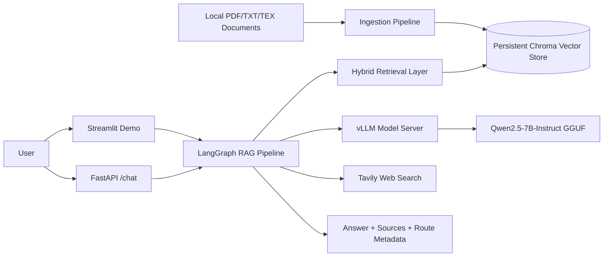

The system separates ingestion, retrieval, orchestration, model serving, web fallback, API access, UI access, and evaluation. This keeps each component independently testable and replaceable.

---

## Decision 1: Separate Model Serving From RAG Application

### Decision

Run vLLM as a separate model server and have the RAG application call it through an OpenAI-compatible HTTP API.

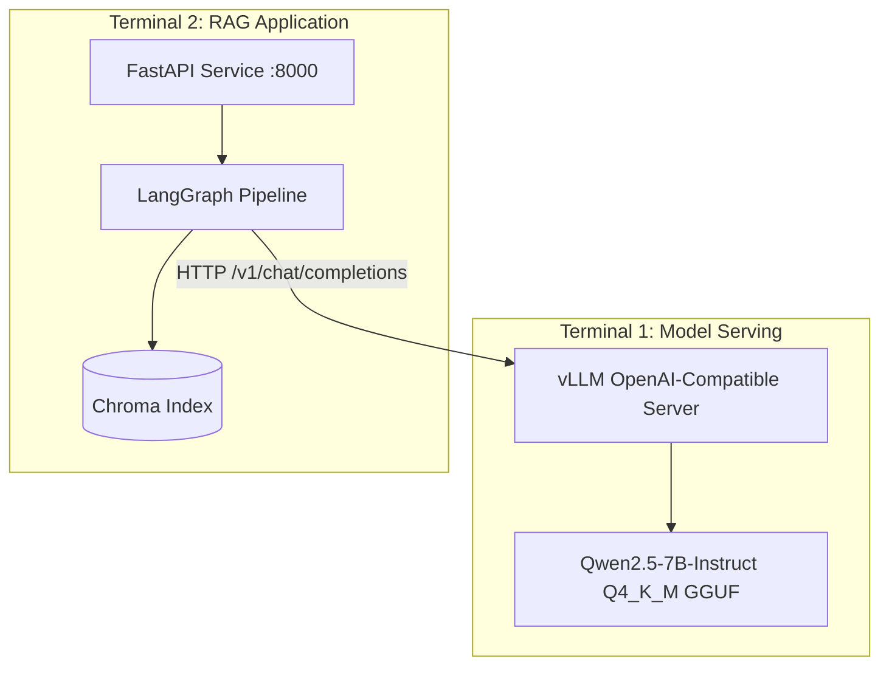

### Implementation

vLLM runs on `localhost:8001`, while the RAG API runs on `localhost:8000`. LangChain uses `ChatOpenAI` pointed at the vLLM base URL.

```python
# graph/chains/llm.py
from langchain_openai import ChatOpenAI

from graph.config import VLLM_API_KEY, VLLM_BASE_URL, VLLM_MODEL


def get_llm(max_tokens: int = 1024) -> ChatOpenAI:
    return ChatOpenAI(
        model=VLLM_MODEL,
        api_key=VLLM_API_KEY,
        base_url=VLLM_BASE_URL,
        temperature=0.1,
        max_tokens=max_tokens,
        max_retries=3,
    )
```

### Rationale

- Keeps GPU/model lifecycle separate from API and retrieval code.
- Allows model swaps without graph rewrites.
- Keeps local serving compatible with LangChain's OpenAI-style client.
- Makes the RAG application easier to test without embedding model-serving concerns.

### Consequences

Positive:

- Cleaner service boundaries.
- Easier model replacement.
- Better operational isolation.

Negative:

- Requires two running services for full pipeline execution.
- Evaluation must check model-server availability before full pipeline runs.

---

## Decision 2: Use Environment-Driven Configuration With Validation

### Decision

Expose operational parameters through environment variables and validate unsafe combinations at startup.

### Implementation

```python
# graph/config.py
CHUNK_SIZE = int(os.getenv("CHUNK_SIZE", "750"))
CHUNK_OVERLAP = int(os.getenv("CHUNK_OVERLAP", "120"))
RETRIEVAL_K = int(os.getenv("RETRIEVAL_K", "8"))
MAX_GENERATION_ATTEMPTS = int(os.getenv("MAX_GENERATION_ATTEMPTS", "2"))
MAX_WEB_SEARCH_ATTEMPTS = int(os.getenv("MAX_WEB_SEARCH_ATTEMPTS", "1"))

if CHUNK_OVERLAP < 0 or CHUNK_OVERLAP >= CHUNK_SIZE:
    raise ValueError("CHUNK_OVERLAP must be non-negative and smaller than CHUNK_SIZE.")
```

Important defaults:

- `VLLM_BASE_URL=http://localhost:8001/v1`
- `VLLM_MODEL=qwen2.5-7b-instruct-q4_k_m`
- `CHROMA_COLLECTION_NAME=rag-chroma`
- `CHROMA_PERSIST_DIRECTORY=./.chroma`
- `EMBEDDING_MODEL=all-MiniLM-L6-v2`
- `CHUNK_SIZE=750`
- `CHUNK_OVERLAP=120`
- `RETRIEVAL_K=8`
- `MAX_GENERATION_ATTEMPTS=2`
- `MAX_WEB_SEARCH_ATTEMPTS=1`

### Rationale

- Retrieval and graph behavior must be tunable without code changes.
- Invalid chunking settings can silently degrade or break retrieval.
- Retry limits should be explicit and configurable.

### Consequences

Positive:

- Easy experimentation with chunking, retrieval depth, and retry limits.
- Fail-fast behavior for invalid configuration.

Negative:

- Changing chunk size or overlap requires re-ingestion because existing chunks are not rewritten automatically.

---

## Decision 3: Build a Local Document Ingestion Pipeline

### Decision

Support local `.pdf`, `.txt`, and `.tex` documents, split them into overlapping chunks, embed them, and persist them in Chroma.

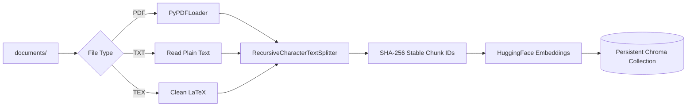

### Implementation

```python
# ingestion.py
def get_text_splitter() -> RecursiveCharacterTextSplitter:
    return RecursiveCharacterTextSplitter.from_tiktoken_encoder(
        chunk_size=CHUNK_SIZE,
        chunk_overlap=CHUNK_OVERLAP,
    )


def document_id(doc: Document, index: int) -> str:
    source = str(doc.metadata.get("source", "unknown"))
    page = str(doc.metadata.get("page", ""))
    payload = f"{source}:{page}:{index}:{doc.page_content}".encode("utf-8")
    return hashlib.sha256(payload).hexdigest()


def ingest_documents(documents: Sequence[Document], rebuild: bool = False) -> int:
    persist_dir = Path(CHROMA_PERSIST_DIRECTORY)
    if rebuild and persist_dir.exists():
        get_retriever.cache_clear()
        shutil.rmtree(persist_dir)

    splits = split_documents(documents)
    if not splits:
        return 0

    vectorstore = get_vectorstore()
    ids = [document_id(doc, index) for index, doc in enumerate(splits)]
    vectorstore.add_documents(splits, ids=ids)
    get_retriever.cache_clear()
    return len(splits)
```

### Rationale

- Local files are the primary knowledge source.
- Persistent Chroma avoids recomputing embeddings on every run.
- Stable SHA-256 IDs make indexed chunks deterministic.
- Chunk defaults are tuned for report-style documents where subsection context matters.

### Consequences

Positive:

- Supports repeatable local document QA.
- Supports both CLI ingestion and Streamlit upload ingestion.

Negative:

- Chroma index lifecycle must be managed when chunking settings change.
- PDF extraction quality depends on `PyPDFLoader` and source PDF layout.

---

## Decision 4: Normalize LaTeX Before Indexing

### Decision

Clean `.tex` files into retrieval-friendly plain text before chunking and embedding.

### Implementation

```python
# ingestion.py
def clean_latex(text: str) -> str:
    text = re.sub(r"(?<!\\)%.*", "", text)
    text = re.sub(
        r"\\(section|subsection|subsubsection|paragraph)\*?\{([^}]*)\}",
        r"\2\n",
        text,
    )
    text = re.sub(r"\\(begin|end)\{[^}]*\}", "\n", text)
    text = re.sub(r"\\(cite|ref|label|url)\*?(\[[^]]*\])?\{([^}]*)\}", r"\3", text)
    text = re.sub(r"\\[a-zA-Z]+\*?(\[[^]]*\])?(\{[^}]*\})?", " ", text)
    text = re.sub(r"[{}]", " ", text)
    text = re.sub(r"\s+", " ", text)
    return text.strip()
```

### Rationale

- The goal is retrieval quality, not perfect LaTeX rendering.
- Section titles, references, and core prose should be preserved.
- LaTeX commands and formatting artifacts add embedding noise.

### Consequences

Positive:

- Better embeddings for LaTeX sources.
- More uniform text across PDF, TXT, and TEX inputs.

Negative:

- Complex LaTeX structures are not faithfully represented.
- Tables and equations may lose semantic detail.

---

## Decision 5: Use Lightweight Hybrid Retrieval

### Decision

Use Chroma dense vector retrieval as the primary search path, and supplement it with lexical retrieval for questions that appear to refer to local documents.

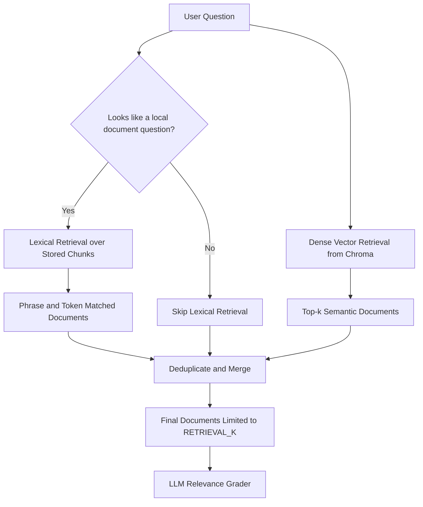

### Implementation

```python
# graph/nodes/retrieve.py
def lexical_score(question: str, document: str) -> int:
    query_terms = tokenize(question)
    if not query_terms:
        return 0

    document_lower = document.lower()
    document_terms = tokenize(document)

    score = 2 * len(query_terms & document_terms)
    for phrase in re.findall(r"[a-z0-9]+(?:\s+[a-z0-9]+){1,3}", question.lower()):
        if phrase in document_lower:
            score += 3

    if "research goal" in question.lower() and "goal of this research" in document_lower:
        score += 8

    return score
```

```python
# graph/nodes/retrieve.py
def retrieve(state: GraphState) -> Dict[str, Any]:
    question = state["question"]
    documents = list(get_retriever().invoke(question))

    if is_local_document_question(question):
        documents = merge_documents(documents, lexical_retrieve(question))

    return {
        "documents": documents,
        "retrieved_documents": documents,
        "question": question,
    }
```

### Rationale

- Dense retrieval handles semantic similarity.
- Local reports often contain exact phrases, section names, table labels, or chapter references.
- Lexical supplementation improves recall for phrasing-sensitive questions without introducing a heavier reranker.

### Consequences

Positive:

- Better recall for exact local document references.
- No additional external service required.
- Maintains low implementation complexity.

Negative:

- Lexical scoring is heuristic.
- It is not a full BM25 implementation.
- Special-case boosts can become brittle if overused.

### Alternatives Considered

- Dense-only retrieval: simpler, but weaker for exact report phrasing.
- Full BM25 plus dense retrieval: stronger retrieval foundation, but adds another index and more operational complexity.
- Cross-encoder reranking: likely better precision, but increases latency and model cost.

---

## Decision 6: Use LangGraph for Corrective RAG Orchestration

### Decision

Represent the RAG workflow as a graph with explicit routing, correction, retry, and fallback behavior.

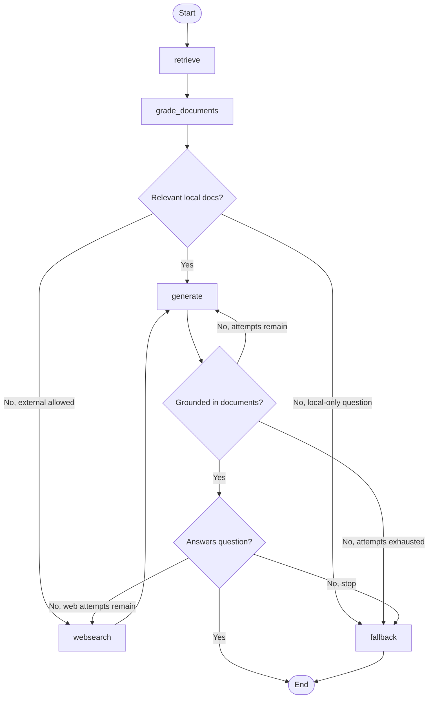

### Implementation

```python
# graph/state.py
class GraphState(TypedDict):
    question: str
    generation: NotRequired[str]
    generation_attempts: NotRequired[int]
    web_search: NotRequired[bool]
    web_search_attempts: NotRequired[int]
    documents: NotRequired[List[Document]]
    retrieved_documents: NotRequired[List[Document]]
    graded_documents: NotRequired[List[Document]]
```

### Rationale

- A graph makes control flow explicit and testable.
- Corrective RAG requires conditional paths, not just a linear chain.
- Intermediate state can be captured for evaluation and debugging.

### Consequences

Positive:

- Clear routing decisions.
- Testable graph branches.
- Observable intermediate state.

Negative:

- More moving parts than a simple chain.
- Requires careful bounded execution controls.

---

## Decision 7: Grade Retrieved Documents Before Generation

### Decision

Use an LLM relevance grader to filter retrieved documents before generation.

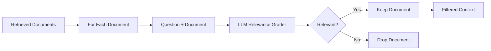

### Implementation

```python
# graph/nodes/grade_documents.py
def grade_documents(state: GraphState) -> Dict[str, Any]:
    question = state["question"]
    documents = state["documents"]

    filtered_docs = []
    for index, d in enumerate(documents, start=1):
        score = retrieval_grader.invoke(
            {"question": question, "document": d.page_content}
        )
        grade = str(score.binary_score).strip().lower()
        relevant = grade in {"yes", "true", "1"}

        if relevant:
            filtered_docs.append(d)

    web_search = not filtered_docs
    return {
        "documents": filtered_docs,
        "graded_documents": filtered_docs,
        "question": question,
        "web_search": web_search,
    }
```

### Rationale

- Vector retrieval can return semantically nearby but non-answering chunks.
- Generation should receive a filtered context.
- Graded documents provide observability for evaluation.

### Consequences

Positive:

- Reduces irrelevant context before generation.
- Improves failure traceability.

Negative:

- Adds one LLM call per retrieved document.
- Relevance grader mistakes can remove needed evidence.

---

## Decision 8: Preserve Local-Document Semantics With a Web-Fallback Guardrail

### Decision

If a question appears to ask about local documents, do not answer from web search when local evidence is missing.

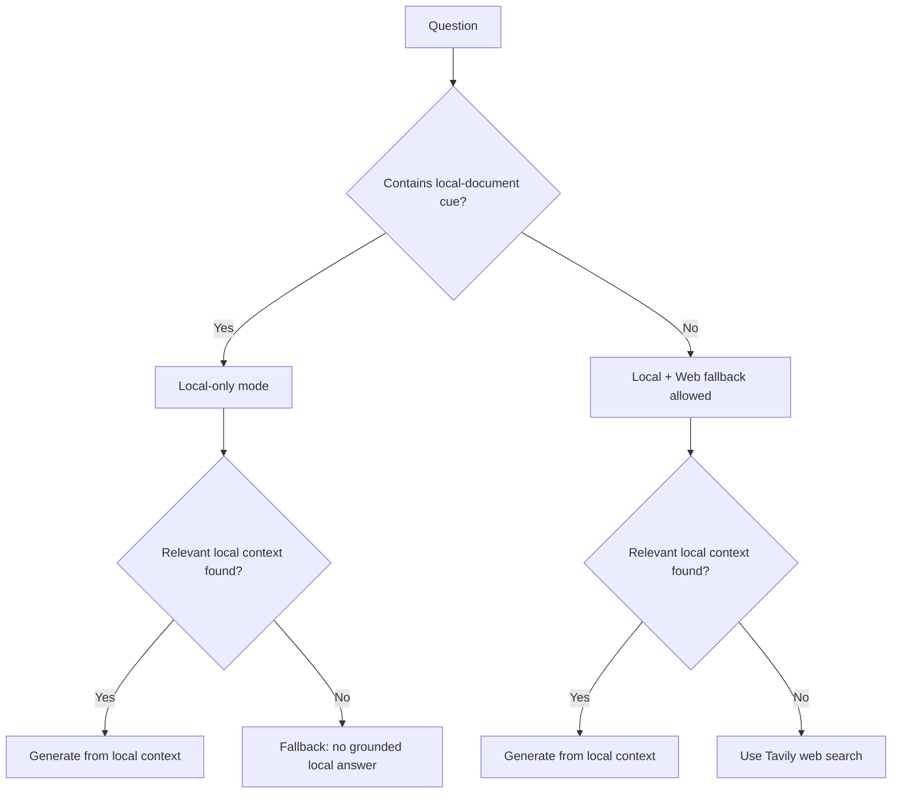

### Implementation

```python
# graph/local_questions.py
LOCAL_DOCUMENT_CUES = (
    "according to the document",
    "according to the pdf",
    "according to the report",
    "in the document",
    "in the pdf",
    "in the report",
    "this document",
    "this pdf",
    "this report",
    "the document",
    "the pdf",
    "the report",
    "chapter ",
    "section ",
)


def is_local_document_question(question: str) -> bool:
    normalized = question.lower()
    return any(cue in normalized for cue in LOCAL_DOCUMENT_CUES)
```

### Rationale

- “According to the report” requires report-grounded evidence.
- A web answer can be factually correct but route-incorrect.
- Source substitution is a serious RAG failure mode.

### Consequences

Positive:

- Safer local document behavior.
- Better abstention for missing local evidence.
- Evaluation can distinguish local, web, and abstain routes.

Negative:

- Cue detection is heuristic.
- Some valid questions may be classified too conservatively.

---

## Decision 9: Use Strict Context-Bound Generation

### Decision

The generation prompt instructs the model to answer only from provided context and abstain when the context is insufficient.

### Implementation

```python
# graph/chains/generation.py
prompt = ChatPromptTemplate.from_messages(
    [
        (
            "system",
            "You are a careful RAG assistant. Answer the question using only the "
            "provided context. If the context does not contain the answer, say that "
            "you do not know. Keep the answer concise.",
        ),
        ("human", "Question:\n{question}\n\nContext:\n{context}"),
    ]
)

generation_chain = prompt | llm | StrOutputParser()
```

```python
# graph/nodes/generate.py
def format_documents(documents) -> str:
    formatted = []
    for index, doc in enumerate(documents, start=1):
        source = doc.metadata.get("source", "unknown") if doc.metadata else "unknown"
        formatted.append(f"[{index}] Source: {source}\n{doc.page_content}")
    return "\n\n".join(formatted)
```

### Rationale

- The model should not answer from hidden parametric knowledge.
- Source-labeled context helps human debugging and downstream rendering.
- Low-temperature generation improves repeatability.

### Consequences

Positive:

- Lower hallucination risk.
- More predictable answers.

Negative:

- The model can still ignore instructions, so post-generation graders remain necessary.

---

## Decision 10: Validate Generated Answers Before Accepting Them

### Decision

Use post-generation hallucination and answer-usefulness graders before accepting an answer.

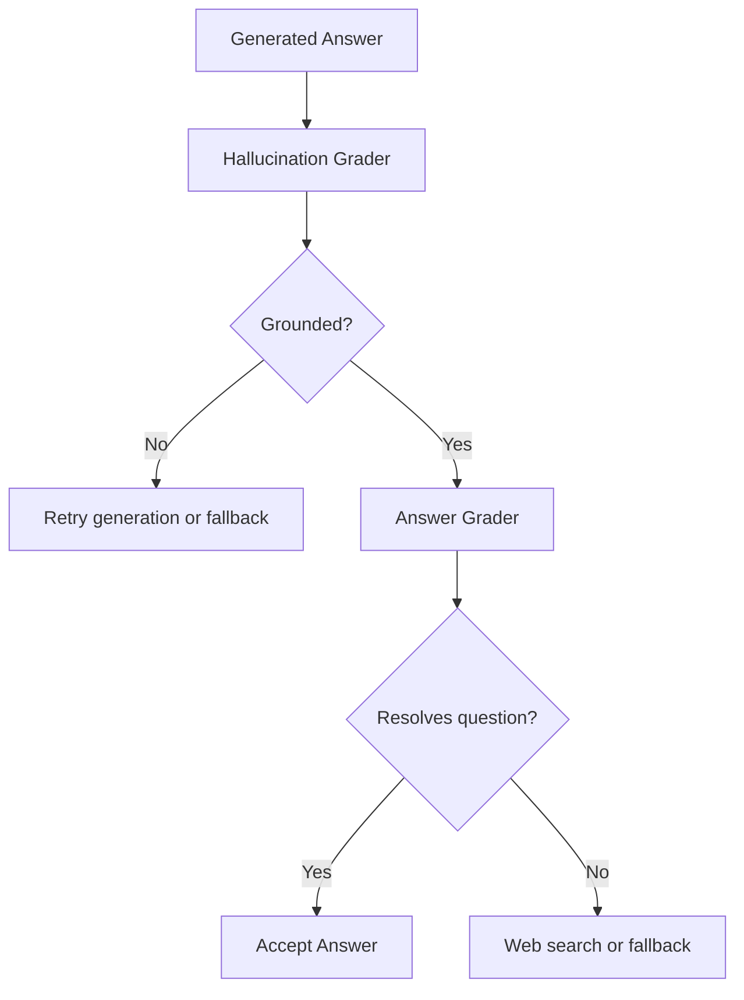

### Implementation

```python
# graph/chains/hallucination_grader.py
class GradeHallucinations(BaseModel):
    binary_score: bool = Field(
        description="Answer is grounded in the facts, 'yes' or 'no'"
    )
```

```python
# graph/chains/answer_grader.py
class GradeAnswer(BaseModel):
    binary_score: bool = Field(
        description="Answer addresses the question, 'yes' or 'no'"
    )
```

### Rationale

- A generated answer can be fluent but unsupported.
- A grounded answer can still fail to answer the user's question.
- Groundedness and usefulness are separate checks.

### Consequences

Positive:

- Stronger answer acceptance criteria.
- Clearer failure modes.

Negative:

- Additional LLM calls increase latency.
- LLM graders can produce false positives or false negatives.

---

## Decision 11: Bound Retries and Provide a Safe Fallback

### Decision

Limit generation and web-search retries, then return a safe fallback response if no sufficiently supported answer can be produced.

### Implementation

```python
# graph/graph.py
if hallucination_grade := score.binary_score:
    score = answer_grader.invoke({"question": question, "generation": generation})
    if answer_grade := score.binary_score:
        return "useful"

    if is_local_document_question(question):
        return "give up"

    if web_search_attempts < MAX_WEB_SEARCH_ATTEMPTS:
        return "not useful"

    return "give up"

if generation_attempts < MAX_GENERATION_ATTEMPTS:
    return "not supported"

return "give up"
```

```python
# graph/nodes/fallback.py
def fallback(state: GraphState) -> Dict[str, Any]:
    return {
        "documents": state.get("documents", []),
        "question": state["question"],
        "generation": (
            "I could not produce an answer that was sufficiently supported by the "
            "available local or web sources."
        ),
    }
```

### Rationale

- Corrective graphs can loop if retries are not bounded.
- Users need a clear failure response instead of an empty answer or infinite wait.
- Evaluation should be able to identify bounded fallback behavior.

### Consequences

Positive:

- Prevents infinite execution.
- Makes failure explicit.

Negative:

- Some answerable cases may fallback if retrieval or graders fail.

---

## Decision 12: Use Tavily for External Web Fallback

### Decision

Use Tavily search when local context is insufficient and web fallback is allowed.

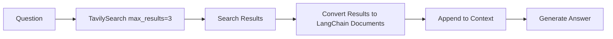

### Implementation

```python
# graph/nodes/web_search.py
def web_search(state: GraphState) -> Dict[str, Any]:
    question = state["question"]
    documents = list(state.get("documents") or [])
    web_search_attempts = state.get("web_search_attempts", 0) + 1

    tavily_results = get_web_search_tool().invoke({"query": question})["results"]
    for result in tavily_results:
        content = result.get("content")
        if not content:
            continue
        documents.append(
            Document(
                page_content=content,
                metadata={
                    "source": result.get("url", "web_search"),
                    "title": result.get("title"),
                    "file_type": "web",
                },
            )
        )

    return {
        "documents": documents,
        "question": question,
        "web_search": True,
        "web_search_attempts": web_search_attempts,
    }
```

### Rationale

- Some user questions are external to the local corpus.
- Web fallback should be visible and source-attributed.
- Tavily provides a simple search integration through LangChain.

### Consequences

Positive:

- External questions can still be answered.
- Web provenance is preserved in document metadata.

Negative:

- Web quality depends on Tavily results.
- External search introduces provider dependency and API-key requirements.

---

## Decision 13: Expose the Pipeline Through FastAPI

### Decision

Wrap the graph in a FastAPI service with schema validation, API-key authentication, and rate limiting.

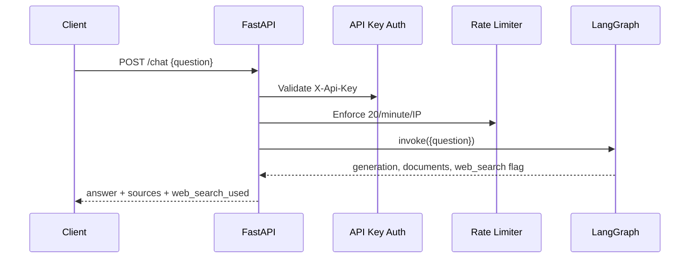

### Implementation

```python
# api/app.py
@api.post("/chat", response_model=ChatResponse, dependencies=[Depends(verify_api_key)])
@limiter.limit("20/minute")
async def chat(request: Request, body: ChatRequest):
    try:
        result = rag_graph.invoke(input={"question": body.question})
    except Exception as e:
        raise HTTPException(
            status_code=500, detail=f"Graph invocation failed: {str(e)}"
        )

    answer = result.get("generation", "")
    raw_docs = result.get("documents", [])
    web_search_used = bool(result.get("web_search", False))

    return ChatResponse(
        answer=answer,
        documents=[
            DocumentItem(
                page_content=doc.page_content,
                source=doc.metadata.get("source") if doc.metadata else None,
            )
            for doc in raw_docs
        ],
        web_search_used=web_search_used,
    )
```

```python
# api/schemas.py
class ChatRequest(BaseModel):
    question: str

    @field_validator("question")
    @classmethod
    def question_must_not_be_empty(cls, v):
        if not v.strip():
            raise ValueError("Question cannot be empty.")
        if len(v) > 2000:
            raise ValueError("Question too long. Max 2000 characters.")
        return v.strip()
```

```python
# api/auth.py
async def verify_api_key(x_api_key: str = Header(...)):
    if not API_SECRET_KEY:
        raise HTTPException(
            status_code=500,
            detail="Server misconfiguration: API_SECRET_KEY is not set."
        )
    if x_api_key != API_SECRET_KEY:
        raise HTTPException(
            status_code=401,
            detail="Invalid API key. Pass your key in the X-Api-Key header."
        )
```

### Rationale

- The graph should be usable outside a notebook or CLI.
- Expensive graph invocation requires basic access control and throttling.
- Pydantic request and response models make the interface explicit.

### Consequences

Positive:

- Clean service interface.
- Safer public-ish endpoint behavior.
- Source metadata is included in responses.

Negative:

- Synchronous invocation can limit concurrency under load.
- API-key auth is simple and may need replacement for multi-user production deployments.

---

## Decision 14: Provide a Streamlit Demo UI

### Decision

Build a Streamlit app for local document upload, ingestion, chat, and source preview.

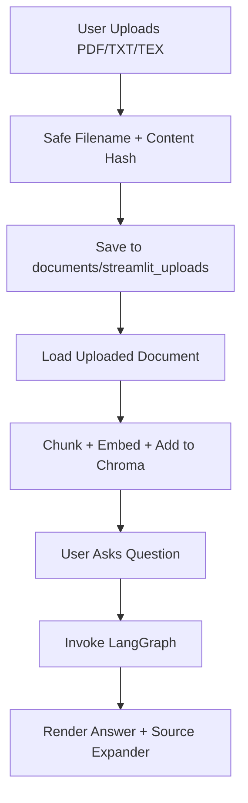

### Implementation

```python
# streamlit_app.py
def safe_upload_path(filename: str, content: bytes) -> Path:
    suffix = Path(filename).suffix.lower()
    if suffix not in SUPPORTED_LOCAL_EXTENSIONS:
        raise ValueError(f"Unsupported file type: {suffix or 'none'}")

    stem = re.sub(r"[^A-Za-z0-9._-]+", "-", Path(filename).stem).strip("-._")
    stem = stem or "document"
    digest = hashlib.sha256(content).hexdigest()[:12]
    return UPLOAD_DIRECTORY / f"{stem}-{digest}{suffix}"
```

### Rationale

- A local demo is useful for interview, testing, and stakeholder review.
- Uploads should be safely named and deduplicated by content hash.
- Source rendering helps users inspect grounding evidence.

### Consequences

Positive:

- Easy hands-on demonstration.
- Uses the same graph and vector store as the API.

Negative:

- Uploaded files and vector index are shared across browser sessions.
- Visible chat history is UI-only and is not passed to the graph as conversational memory.

---

## Decision 15: Build Evaluation Into the Repository

### Decision

Create a benchmark runner that can evaluate retrieval-only and full-pipeline behavior and write durable result artifacts.

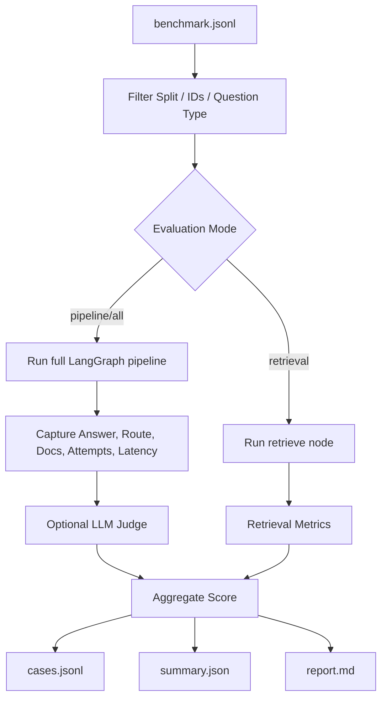

### Benchmark Design

Benchmark file:

- `evaluation/benchmark.jsonl`

Each case includes:

- `id`
- `split`
- `question_type`
- `difficulty`
- `answerability`
- `expected_route`
- `safety_critical`
- `question`
- `reference_answer`
- `required_facts`
- `forbidden_claims`
- `evidence_groups`

Example:

```json
{
  "id": "creya-004",
  "split": "dev",
  "question_type": "single_hop",
  "difficulty": "easy",
  "answerability": "local",
  "expected_route": "local",
  "question": "What is the research goal stated in Chapter 1?",
  "required_facts": [
    "Design, develop, and critically evaluate an inventory management and distribution system",
    "Target is an EdTech startup",
    "Current process uses manual workflows and disconnected Excel sheets"
  ],
  "evidence_groups": [
    {
      "pdf_pages": [8],
      "page_indices": [7],
      "sections": ["1"]
    }
  ]
}
```

### Evaluation Metrics Used

The evaluation framework measures the system across retrieval quality, answer quality, routing behavior, safety behavior, and operational reliability.

#### Retrieval Metrics

These are computed for cases where `answerability="local"` and ground-truth evidence pages are available.

| Metric | Definition | Why It Matters |
|---|---|---|
| Evidence-group recall | Fraction of evidence groups where at least one retrieved chunk comes from a listed relevant page | Measures whether the retriever covers all required supporting evidence, especially for multi-hop questions |
| Hit rate | Whether at least one retrieved document comes from any relevant evidence page | Measures basic retrieval success |
| MRR | Reciprocal rank of the first relevant retrieved chunk | Rewards placing relevant evidence early in the context |
| Context precision proxy | Relevant retrieved chunks divided by total retrieved chunks | Estimates how much of the model context is actually useful |

The same retrieval metrics are reported before and after LLM document grading when running the full pipeline. This shows whether the relevance grader improves context precision or accidentally removes required evidence.

#### Answer Quality Metrics

These are produced by the structured LLM judge for full-pipeline evaluations.

| Metric | Scale | Definition |
|---|---:|---|
| Required-fact coverage | `0.0` to `1.0` | Fraction of expected facts correctly expressed in the generated answer |
| Faithfulness | `0.0`, `0.5`, or `1.0` | Whether material claims are supported by retrieved context |
| Directness | `0.0` to `1.0` | Whether the answer resolves the exact question without drifting in scope |
| Completeness | `0.0` to `1.0` | Whether necessary qualifiers, units, ordering, or constraints are included |
| Contradiction | Boolean | Whether the answer endorses a forbidden claim |
| Critical failure | Boolean | Whether a safety-critical answer fabricates or contradicts critical information |

#### Routing and Abstention Metrics

| Metric | Definition |
|---|---|
| Route accuracy | Whether the actual route matches the expected route: `local`, `web`, or `abstain` |
| Abstention correctness | Whether the system correctly avoids inventing an answer for unanswerable cases |
| Web grounding | Whether web-fallback answers are supported by identifiable retrieved web sources |
| Bounded fallback | Whether the system ended with the configured fallback message after failing quality checks |

#### Grader Accuracy Metrics

The evaluation harness rechecks pipeline graders against judge labels.

| Metric | Definition |
|---|---|
| Hallucination-grader accuracy | Whether the pipeline groundedness decision matches judge faithfulness |
| Answer-grader accuracy | Whether the pipeline usefulness decision matches high fact coverage, directness, and no contradiction |

#### Operational Metrics

| Metric | Definition |
|---|---|
| Completion rate | Fraction of cases returning a non-empty answer without exception or timeout |
| Bounded execution | Fraction of cases staying within configured generation and web-search attempt limits |
| p50 latency | Median end-to-end case latency |
| p95 latency | 95th percentile end-to-end case latency |
| Mean pipeline LLM calls | Average number of chat/LLM calls per case |
| p95 pipeline LLM calls | 95th percentile LLM call count |
| Repeatability | Whether repeated runs choose the same route and keep fact coverage within a small tolerance |
| Observability | Whether the record contains retrieved docs, attempt counts, final docs, and route metadata |

#### Aggregate Scoring

The 100-point evaluation rubric is organized as:

| Category | Points |
|---|---:|
| Retrieval | 25 |
| Answer quality | 40 |
| Routing, abstention, and verification | 20 |
| Performance and reliability | 15 |

Critical failures can cap the normalized score at `59/100`, even when the numeric component score is higher.

### Retrieval Metric Implementation

```python
# evaluation/run_evals.py
def retrieval_metrics(
    documents: Sequence[Document], case: dict[str, Any]
) -> dict[str, float] | None:
    groups = case.get("evidence_groups", [])
    if case.get("answerability") != "local" or not groups:
        return None

    pages = [document_page_index(document) for document in documents]
    relevant_pages = relevant_page_indices(case)
    group_hits = [
        any(page in set(group.get("page_indices", [])) for page in pages)
        for group in groups
    ]
    relevant_ranks = [
        rank
        for rank, page in enumerate(pages, start=1)
        if page is not None and page in relevant_pages
    ]

    return {
        "evidence_group_recall": sum(group_hits) / len(group_hits),
        "hit": float(bool(relevant_ranks)),
        "mrr": 1.0 / min(relevant_ranks) if relevant_ranks else 0.0,
        "context_precision_proxy": (
            relevant_count / len(documents) if documents else 0.0
        ),
    }
```

### LLM-as-Judge

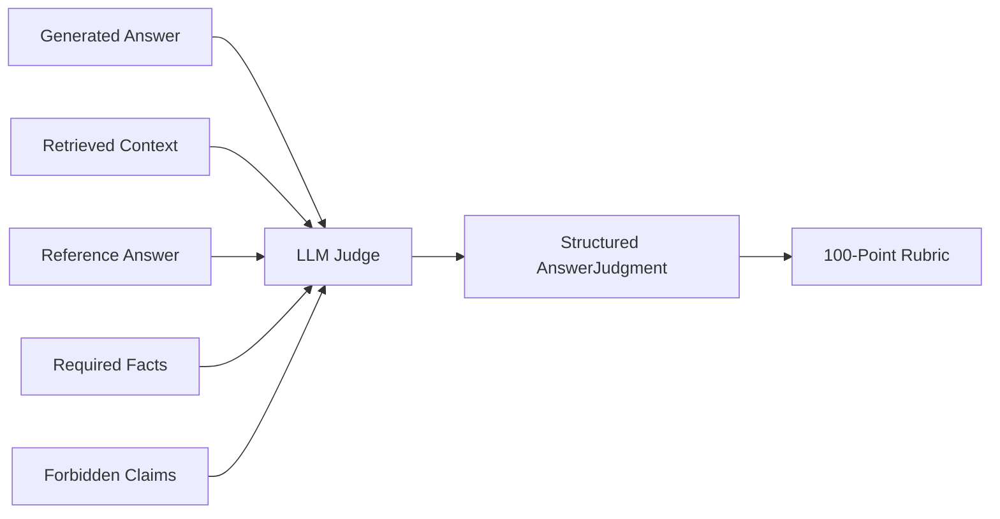

```python
# evaluation/run_evals.py
class AnswerJudgment(BaseModel):
    required_fact_coverage: float = Field(ge=0.0, le=1.0)
    faithfulness: Literal[0.0, 0.5, 1.0]
    directness: float = Field(ge=0.0, le=1.0)
    completeness: float = Field(ge=0.0, le=1.0)
    contradiction: bool
    critical_failure: bool
    abstention_correct: bool
    web_grounded: bool
    rationale: str
```

### Observability

```python
# evaluation/run_evals.py
record.update(
    {
        "answer": answer,
        "generation_attempts": result.get("generation_attempts", 0),
        "web_search_attempts": result.get("web_search_attempts", 0),
        "web_search_used": bool(result.get("web_search", False)),
        "bounded_fallback": answer.startswith(FALLBACK_PREFIX),
    }
)

record["retrieved_documents"] = [
    serialize_document(document) for document in raw_documents
]
record["graded_documents"] = [
    serialize_document(document) for document in graded_documents
]
record["final_documents"] = [
    serialize_document(document) for document in final_documents
]
```

### Rationale

- RAG quality must be measured across retrieval, routing, generation, abstention, and reliability.
- Benchmark cases with required facts and forbidden claims make failures easier to diagnose.
- Durable result artifacts support iterative comparison.

### Consequences

Positive:

- Evaluation is part of the engineering workflow.
- Failures can be traced to specific pipeline stages.
- Route correctness and abstention are measurable.

Negative:

- LLM-as-judge adds cost and may itself be imperfect.
- Full evaluations require a running vLLM server.

---

## Decision 16: Use Automated Tests for Routing and Evaluation Logic

### Decision

Add tests for graph routing and evaluation helper behavior.

### Verified Command

```bash
uv run pytest graph evaluation
```

Current verified result:

```text
11 passed in 8.94s
```

### Example Test

```python
# graph/tests/test_graph_routing.py
def test_local_document_question_does_not_use_web_when_retrieval_fails():
    state = graph_state(
        question="What is the research goal stated in Chapter 1?",
        documents=[],
        web_search=True,
    )

    assert graph_module.decide_to_generate(state) == graph_module.FALLBACK
```

### Covered Behaviors

- Unsupported generation retries below configured limit.
- Unsupported generation stops at max generation limit.
- Unhelpful generation searches web only within limit.
- Local document questions do not use web fallback.
- Fallback replaces unsupported generation.
- Retrieval metrics cover evidence groups.
- External cases are not scored with local retrieval metrics.
- Percentile interpolation works.
- Route classification uses judged abstention.
- Retrieval-only aggregate scoring works.

### Rationale

- Routing and retry behavior are high-risk logic.
- Tests provide confidence that local-document guardrails are preserved.
- Evaluation math should remain stable as the pipeline evolves.

---

## Consequences Summary

### Benefits

- Strong local-first behavior.
- Explicit graph routing and bounded retries.
- Better grounding through relevance grading and post-generation validation.
- Source traceability across API and UI.
- Modular model serving through vLLM.
- Built-in evaluation with durable artifacts.
- Tests for critical routing and evaluation logic.

### Costs

- Multiple LLM calls increase latency.
- LLM graders can make incorrect decisions.
- Local-question detection is heuristic.
- Lightweight lexical retrieval is not as robust as BM25 or reranking.
- Full pipeline requires vLLM and Tavily configuration.
- Streamlit demo is not multi-user isolated and has no conversational memory.

---

## Alternatives Considered

### Linear LangChain Chain

Rejected because the workflow requires conditional routing, retries, web fallback, and fallback termination.

### Dense-Only Retrieval

Rejected because exact local document questions often benefit from lexical phrase matching.

### Always Use Web Fallback

Rejected because it can produce source-incorrect answers for local-document questions.

### Load Model Inside API Process

Rejected because it couples GPU model lifecycle to the RAG application and makes swapping models harder.

### No LLM Graders

Rejected because retrieval and generation failures would be harder to detect before returning answers.

---

## Future Work

Recommended improvements:

- Add BM25 plus dense retrieval as a formal hybrid retriever.
- Add cross-encoder reranking for top-k chunks.
- Add citation-level answer generation.
- Track token usage and per-node latency in production logs.
- Add async FastAPI execution for higher concurrency.
- Add persistent user/session-level chat memory where appropriate.
- Add human-labeled evaluation runs to compare against the LLM judge.
- Add Docker Compose for vLLM, API, and UI.
- Add CI for tests and benchmark dry-runs.

---

## Final Architectural Position

This system treats RAG as an AI engineering reliability problem rather than a simple retrieval demo. The core decision is to make uncertainty explicit at every stage:

- Was relevant context retrieved?
- Was the context actually relevant?
- Is the question local-only or eligible for web fallback?
- Is the generated answer grounded?
- Does the generated answer resolve the question?
- Did the graph terminate within bounded limits?
- Can a failed case be traced to a specific component?

That architecture makes the system easier to debug, safer to run, and easier to improve over time.
